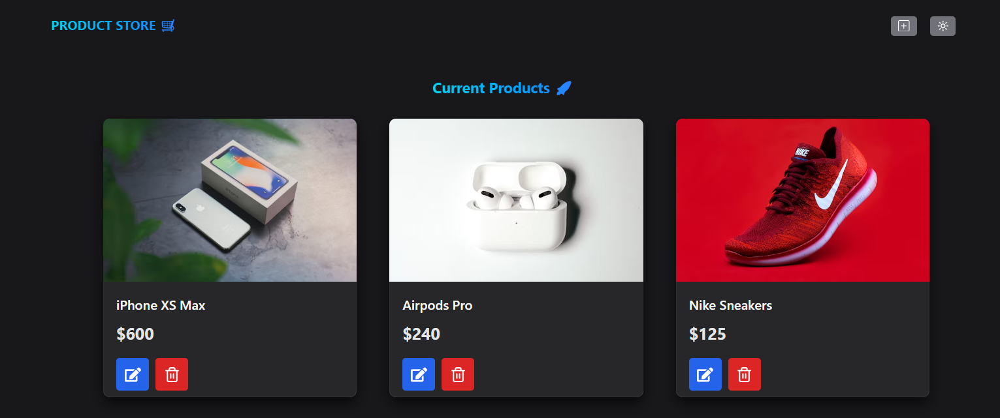

<div align="center">



# 📦 Product Manager App  

     

A modern React + Chakra UI application to **manage products** with style ✨.  
Easily add, edit, update, and delete products with a clean UI and smooth modal dialogs.  


</div>


### 🎯 Features
- 🛍️ **Product Cards** – visually display your products with name, price, and image
- ✏️ **Edit with Modal** – update product details using a responsive Chakra UI Dialog
- 🗑️ **Delete Products** – remove items instantly with confirmation
- 🌗 **Light/Dark Mode** – powered by Chakra’s color mode hooks
- 🔔 **Toasts – instant** feedback with success/error messages
- ⚡ **Optimized State** – powered by useProductStore (Zustand)
  
--- 
### 🖼️ Preview
Here’s a sneak peek 👇


🚀 **Tech Stack**
- React 18 – UI framework
- TypeScript – type safety and better DX
- Chakra UI – accessible and themeable component library
- Zustand – lightweight state management
- React Icons – sleek iconography
---

### ⚙️ Installation
1. Clone the repository:

```bash

git clone https://github.com/your-username/product-manager-app.git
cd product-manager-app
```


2. Install dependencies:
```bash

pnpm install
# or
npm install
# or
yarn install
```

3. Copy the environment example file and configure it:
```bash

cp .env.example .env
```

4. Start the development server:

```bash
Copy code
pnpm dev
```

Then open http://localhost:5173 in your browser 🚀

---

### 🔑 Environment Variables
Create a .env file in the root of your project based on .env.example.

```bash
VITE_API_URL=http://localhost:4000/api
VITE_ENABLE_MOCKS=false
```


| Variable            | Description                                               | Example                     |
| ------------------- | --------------------------------------------------------- | --------------------------- |
| `VITE_API_URL`      | Backend API endpoint for fetching/updating products       | `http://localhost:4000/api` |
| `VITE_ENABLE_MOCKS` | Use mock data when no backend is available (`true/false`) | `true`                      |


>⚡ Remember: all frontend env vars must be prefixed with VITE_ (Vite convention).
---

### 🛠️ Usage
- Click the ✏️ **Edit button** on a product card to open the modal
- Update fields (name, price, image URL) → hit **Update**
- To cancel, hit **Cancel** or close the modal
- Delete products instantly with the 🗑️ **Trash button**
---


### 🤝 Contributing
Contributions are welcome 🎉

1. Fork the repo

1. Create a new branch (git checkout -b feature/amazing-feature)

1. Commit your changes (git commit -m 'Add some amazing feature')

1. Push to the branch (git push origin feature/amazing-feature)

1. Open a Pull Request
---


### ✨ Fun Extras
- 🍕 Built with love, coffee, and way too many snacks.
- 🎨 Styled with Chakra UI because plain CSS is so last season.
- 💡 Pro tip: Don’t forget to test your delete button… or you might delete your boss’s product.
---

### 📂 .env.example

```bash

# Backend API URL
VITE_API_URL=http://localhost:4000/api

# Toggle mock mode (true/false)
VITE_ENABLE_MOCKS=false
```


🔥 Ready to manage products like a pro?
Clone → Configure .env → Run → Customize → Profit 🚀


